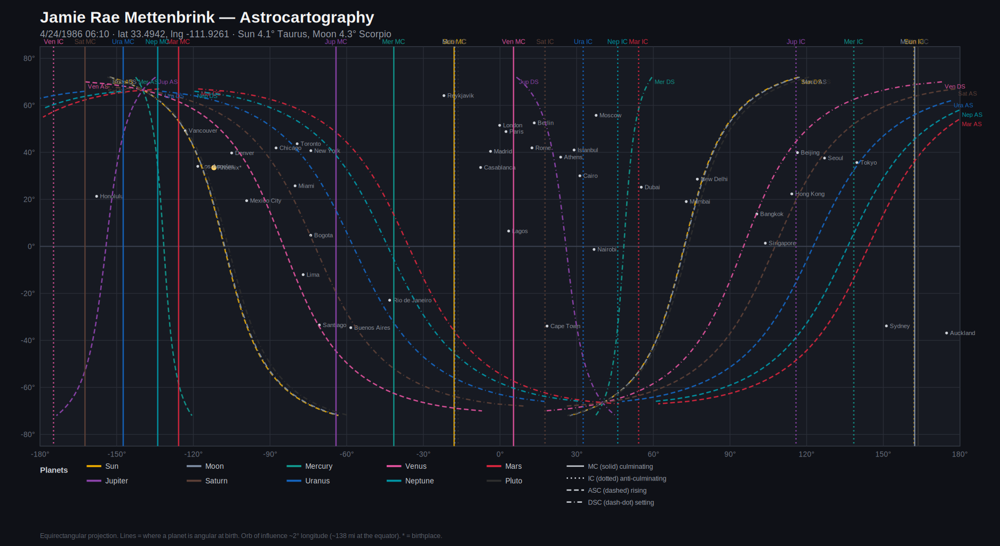

# Jamie Rae Mettenbrink — Astrocartography
### Planetary Relocation Lines · April 24, 1986 · 6:10 AM MST · Scottsdale, AZ

*Birth chart anchors: Sun 4.1° Taurus (1st), Moon 4.3° Scorpio (7th), Taurus rising 10.4°, MC 25.9° Capricorn. An exact Full Moon (Sun opposite Moon, 0.2° orb), with the Moon conjunct Pluto in the 7th.*

---

## How to read this map

Astrocartography takes the exact sky of your birth and asks a different question than a natal chart does. Not *what* the planets were doing, but *where* on Earth each one would have been sitting on one of the four angles — rising, setting, overhead (culminating), or underfoot — at the second you were born. Each planet draws four lines across the globe. Stand near one and that planet's themes get turned up in your life there: louder, more available, sometimes heavier.

Four line types, repeated for all ten planets (40 lines on the map):

- **MC line** (solid, vertical) — the planet at the top of the sky. Career, reputation, what you become *known for* in that place. The most public line.
- **IC line** (dotted, vertical) — the planet at the bottom. Home, roots, the private self, family, the inner foundation.
- **ASC line** (dashed, curved) — the planet rising on the eastern horizon. It fuses with your body and identity; you *become* that planet there, visibly.
- **DSC line** (dash-dot, curved) — the planet setting on the western horizon. It shows up *through other people* — partners, clients, opponents.

A line's pull is strongest within about **1°–2° of longitude** (roughly 70–140 miles) and still noticeable out to ~5°. The map marks major cities as geographic anchors; the birthplace is the gold dot.

**One honesty note on method.** These lines are computed from the same flat-ecliptic positions the natal calculator uses (each body placed on the ecliptic, latitude zero). The MC/IC meridians depend only on a planet's right ascension and are accurate. The ASC/DSC *curves* carry a small error for the two bodies that sit farthest off the ecliptic — the Moon and Pluto — so treat their rising/setting curves as ~1–2° zones, not hairlines.

---

## The lines you were already born on

Before relocating anywhere, notice what your *home* coordinates already carry. You were born just after sunrise, so two lines run almost through Scottsdale and straight up the West Coast of North America:

- **Sun rising (ASC)** and **Moon setting (DSC)** sit on top of each other here. That is the exact Full Moon made geographic: the spot where the Sun comes up is the spot where the Moon goes down, because they were 180° apart. Los Angeles and Vancouver both sit inside this band (Sun ASC ~0.2–1.4°, Moon DSC ~0.1–1.6°).

What that means: the West Coast — your birth region — runs the *whole self vs. the close other* tension as ambient weather. Your identity (Sun rising) and your most intimate bond (Moon setting, in the relationship angle) are wired to the same line. It is a powerful, visible, slightly exposed place to live, because the thing your chart is already working on — being fully yourself *and* deeply merged with one person — is the literal ground under your feet. Most people have to travel to stand on a Sun line. You were born on yours.

And riding right alongside the Moon, everywhere it goes, is **Pluto** — because in your chart they are the same 1.4° embrace in Scorpio. Wherever your Moon lines fall, the Pluto lines fall too. Your emotional life does not get a "light" version anywhere on Earth. It travels with depth attached.

---

## The lines, planet by planet

### Venus — your chart's ruler, so read this one first
Taurus is your rising sign, which makes **Venus the ruler of your entire chart**, and it sits in its own sign in the 1st house. Venus lines are not generic for you; they amplify the planet that already runs the show.

- **Venus ASC** curves through **Chile (Santiago, ~0.4°)** and the southern cone. On a Venus rising line you are met as the easeful, magnetic, good-to-be-around version of yourself. Of all your lines, this is the one most aligned with how you're *already* built.
- **Venus DSC** runs through **Southeast Asia (Bangkok, ~0.2°)** — partnership, attraction, being sought out.
- **Venus MC** crosses **western Europe (the Amsterdam–Marseille meridian) down through Nigeria (Lagos, ~1.9°)** — a public life built on relationship, beauty, taste, or value. Because Venus rules your chart, this is the closest thing you have to a "step into your own light" career line.

### Sun — vitality and being central
- **Sun MC** runs down the **eastern Atlantic: past Iceland, along the edge of Western Europe, through Senegal/West Africa (near Dakar)**. A place to be seen, to lead, to become the center of the room. Strong but exposing — Sun MC asks you to actually want the spotlight.
- **Sun ASC** is the West Coast line described above (home region).

### Moon (with Pluto) — emotional intensity and the fated bond
- **Moon MC ≈ Pluto MC** sit together around **the central/southwest Pacific (toward Fiji and New Zealand's longitude)** — feelings made public, emotional authority, nothing hidden.
- **Moon DSC** is the West Coast line (home). **Moon/Pluto ASC** run together through **the Arabian Sea / western India (~73°E)**. Anywhere these coincide, relationships and inner life run hot, deep, and a little fated. Rich for transformation, costly for peace.

### Mars — exalted, the disciplined warrior
Your Mars is **exalted in Capricorn** (9th house), so it carries a focused, strategic, get-it-done quality rather than raw aggression.
- **Mars MC** runs just **offshore the Pacific Northwest** (mostly ocean — low practical use on land).
- **Mars IC** crosses **the Persian Gulf (Dubai, ~1.0°)** and Iran. Mars on the IC means drive pointed *inward*, at home and foundations — productive for building, but it can heat up domestic life and conflict.

### Jupiter — expansion, luck, the teacher
- **Jupiter MC** runs from **Atlantic Canada (near Halifax) down through the eastern Caribbean into Bolivia and northern Chile**. The classic growth-and-opportunity career line: bigger stage, benefactors, room to expand. Given your Capricorn MC and the 9th-house emphasis in your chart (teaching, philosophy, the faraway), this is your most natural "go bigger" line.
- **Jupiter IC** passes through **East Asia (Beijing ~0.6°, Hong Kong ~1.7°)** — abundance and ease at home, a generous private base.

### Saturn — structure, mastery, weight
- **Saturn DSC** crosses **Colombia (Bogotá, ~0.2°)** — relationships that arrive as duty, lessons, or older/serious partners.
- **Saturn IC** runs through **central Europe (Vienna/Prague meridian) down to Cape Town (~0.8°)** — heavy roots, responsibility at home, building foundations slowly and the hard way. Note: **Saturn rules your Midheaven**, so Saturn lines are tied to your actual vocation — useful for serious, structured ambition; draining if you're already depleted.
- **Saturn ASC** brushes **Korea (Seoul, ~1.4°)**.

### Mercury — mind and voice (timely right now)
Your current Vedic chapter is a **Mercury major-period (2021–2038)**, which makes Mercury lines especially live for you this decade.
- **Mercury MC** runs through **the western Atlantic near Brazil (Rio, ~1.6°)** — being known for your thinking, writing, voice.
- **Mercury IC** sits near **Japan (Tokyo, ~1.2°)** — a studious, mentally busy home base.

### Uranus & Neptune — the generational outers
- **Uranus IC** crosses **Egypt (Cairo, ~1.3°)** and **Uranus ASC** brushes **Tokyo (~0.9°)** — disruption, awakening, restlessness; freeing but unstable.
- **Neptune MC** runs through **the eastern Pacific off California/Mexico** (mostly ocean) — idealization, art, dissolution, fog. Beautiful for creativity, treacherous for clarity.

---

## A relocation guide, by what you might want

- **To step into your own light (work, visibility):** the **Venus MC** band through western Europe, and the **Jupiter MC** band through Atlantic Canada → the Caribbean → Bolivia/Chile. Venus because it rules your chart; Jupiter because it expands the 9th-house, big-picture part of you.
- **To feel magnetic and at ease in your own skin:** the **Venus ASC** line through **Chile** — the cleanest "more yourself, lighter" line you have.
- **For depth, transformation, and the fated kind of love (eyes open):** anywhere the **Moon/Pluto** lines fall — the southwest Pacific, western India. Intensely alive, not restful. Go here to be changed, not to rest.
- **For serious building and earned mastery:** the **Saturn IC** corridor (central Europe → Cape Town). Structure and foundations, at a cost in lightness.
- **For mental work, writing, and voice — and well-timed for this decade:** the **Mercury** lines (Brazil, Japan).
- **Handle with care:** **Neptune** (eastern Pacific) and **Uranus** (Cairo, Tokyo) lines — inspiring but destabilizing. Good to visit, harder to build on.
- **Home already gives you:** the **Sun/Moon Full-Moon line** up the West Coast — high charge, high visibility, the self-and-other theme turned all the way up.

---

## Cities sitting on a line (within 2°)

| Place | Line(s) |
|-------|---------|
| Los Angeles | Sun ASC (1.4°), Moon DSC (1.6°) |
| Vancouver | Sun ASC (0.2°), Moon DSC (0.1°), Pluto DSC (0.6°) |
| Santiago | Venus ASC (0.4°) |
| Bogotá | Saturn DSC (0.2°) |
| Bangkok | Venus DSC (0.2°) |
| Lagos | Venus MC (1.9°) |
| Rio de Janeiro | Mercury MC (1.6°) |
| Beijing / Hong Kong | Jupiter IC (0.6° / 1.7°) |
| Tokyo | Uranus ASC (0.9°), Mercury IC (1.2°) |
| Cairo | Uranus IC (1.3°) |
| Cape Town | Saturn IC (0.8°) |
| Dubai | Mars IC (1.0°) |
| Seoul | Saturn ASC (1.4°) |
| New Delhi | Sun DSC (2.0°) |

---

## Honest limits

Astrocartography is a symbolic relocation technique, not a forecast. The lines are zones of emphasis, not switches, and a place is always more than one line — geography, language, money, and the people already in your life matter more than any of this. The two outer-body horizon curves (Moon, Pluto) are computed to ~1–2°; treat them as bands. And every line here is built from the *same* birth data as your natal chart, so if your recorded birth time were off by a few minutes, the **MC/IC meridian lines shift by roughly that many degrees of longitude** (4 minutes of time ≈ 1° of longitude) — the ASC/DSC curves move too. The 6:10 AM time looks solid against the chart, but that's the one input worth being sure of.

---

*Generated with the un/charted astrocartography calculator (`scripts/calculate_astrocartography.py`). Ephemeris shared with the natal engine; equirectangular projection; orb 2.0° longitude.*
